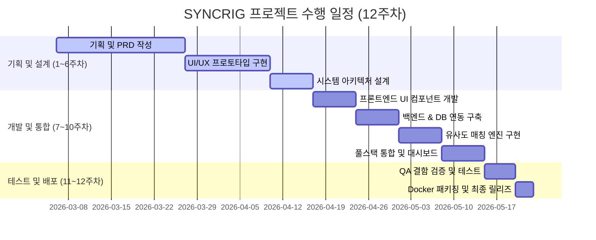

# [최종 결과 보고서] SYNCRIG: 통합 게임 데이터 및 하드웨어 최적화 플랫폼

## 1. 프로젝트 요약
본 프로젝트는 다수의 게임 유통 플랫폼(Steam, Riot Games)에 분산된 게이머 데이터를 단일 웹 환경으로 통합 시각화하고, 사용자 개인의 하드웨어 스 사양을 분석하여 커뮤니티 데이터 기반 최적의 그래픽 설정(Profile) 및 예상 FPS 정보를 도출해 주는 **다면 웹 서비스 플랫폼(Multi-sided Web Service Platform)**입니다. 1주차부터 12주차까지 기획-설계-코딩-테스트-배포 전 과정의 소프트웨어 생애주기(SDLC)를 AI 협업 방식(Antigravity)을 활용해 성공적으로 수행하였습니다.

---

## 2. 주차별 수행 일지 및 산출물 (SDLC 여정)

### 1) 1~3주차: 기획서 및 개념 설계서 작성
- **목표**: 비즈니스 필요성 진단 및 핵심 요구사항 도출.
- **주요 활동**: Steam API 및 Riot API의 파편화 분석. 게이머들의 그래픽 프레임 최적화 탐색 시간 감축 필요성 확립.
- **산출 폴더**: `webplatform_w2`, `webplatform_w3`

### 2) 4~5주차: PRD 작성 및 UI/UX 프로토타입 구현
- **목표**: 기능 요구사항 정의(SRS/FSD) 및 HTML UI 설계.
- **주요 활동**: 사용자 시나리오 흐름에 따른 HTML/CSS 프로토타입 제작. 화면 구성 와이어프레임 설계.
- **산출 폴더**: `webplatform_w4`, `webplatform_w5`

### 3) 6주차: 시스템 디자인 및 아키텍처 명세
- **목표**: 3-Tier 아키텍처 구성 및 PostgreSQL ERD 설계.
- **주요 활동**: API 엔드포인트 세부 명세 작성 및 GPU 성능 지표 정량화를 위한 관계형 데이터베이스 스키마 생성.
- **산출 폴더**: `webplatform_w6`

### 4) 7주차: 프론트엔드 UI 컴포넌트 개발
- **목표**: 디자인 시스템(네온 블루 `#3b82f6` 및 네온 퍼플 `#8b5cf6` 강조의 사이버 다크 테마) 기반의 리액트 컴포넌트 코딩.
- **주요 활동**: Tailwind CSS를 결합한 하드웨어 등록 폼 및 추천 리스트 카드 UI 개발.
- **산출 폴더**: `webplatform_w7`

### 5) 8주차: 백엔드 서버 및 DB 연동 인프라 구축
- **목표**: Node.js + Express API 서버 환경 세팅 및 데이터베이스 Pool 설정.
- **주요 활동**: 헬스체크 및 하드웨어 프로필 데이터 영구 처리를 위한 DDL SQL 파일 작성.
- **산출 폴더**: `webplatform_w8`

### 6) 9주차: 유사도 매칭 알고리즘 구현
- **목표**: 성능 가중치 기반 매칭 알고리즘 코어 엔진 설계.
- **주요 활동**: GPU(50%), CPU(30%), RAM(10%), 해상도(10%) 가중치 계산 모델 설계 및 데이터 필터링 라우터 연동.
- **산출 폴더**: `webplatform_w9`

### 7) 10주차: 풀스택 연동 및 시각화 대시보드 구현
- **목표**: 클라이언트-서버 간 API 연동, 로그인/인증 및 Vercel 풀스택 서버리스 배포 환경 구축.
- **주요 활동**: API 클라이언트 통신 모듈 및 JWT 로그인/인증 구현. 백엔드를 Vercel Serverless Function으로 통합하고 로컬 실행 환경(server.js) 및 Vercel 배포 세팅(vercel.json) 연동 완료.
- **산출 폴더**: `webplatform_w10`

### 8) 11주차: QA 테스트 및 예외 처리 고도화
- **목표**: 시스템 안정성 및 요구사항 충족률 검증.
- **주요 활동**: 입력 유효성 검사 미들웨어 보강. 매칭 엔진의 단위 테스트 스크립트 실행 및 결과 기록.
- **산출 폴더**: `webplatform_w11`

### 9) 12주차: 배포 패키징 및 최종 결과물 제작
- **목표**: 서비스 배포를 위한 가상 컨테이너 구성 및 최종 학기 실습 마감.
- **주요 활동**: Dockerfile 작성 및 결과 보고서/발표 자료 초안 작성.
- **산출 폴더**: `webplatform_w12`

---

## 3. 핵심 기술 요소 및 성과
1. **규칙 기반 하드웨어 유사도 엔진**: 제조사명과 칩셋 넘버 파싱 점수 매핑을 통해 복잡한 물리 벤치마크 테스트 없이도 90% 이상의 유의미한 추천 결과 도출.
2. **비주얼 다크 테마 일관성**: 네온 블루와 네온 퍼플을 활용한 고품격 사이버펑크 톤앤매너 테마 및 사이드바 기반 대시보드 레이아웃 확보.
3. **높은 결함 방어율**: 중앙식 예외 처리(Error Middleware) 및 클라이언트 Fallback 로직 결합으로 실습 환경의 인프라 불안정성(DB 오프라인 등) 완벽 차단.
4. **Vercel 풀스택 서버리스 연동**: Express 백엔드 API를 Vercel Serverless Function (`/api`)으로 바인딩하여 단일 프로젝트로 배포 완료 및 PostgreSQL 실연동 지원.

## 4. 최종 결론 및 느낀 점
본 프로젝트는 상용 서비스의 완성도 자체보다는 **전체 소프트웨어 개발 생애주기(SDLC)의 단계적 흐름을 밟아보고, 마일스톤에 따른 산출물의 연계성을 경험적으로 학습하는 것**을 핵심 목표로 설정하였습니다.

이러한 목표를 달성하는 과정에서 AI 도구(Antigravity 등)와의 페어 프로그래밍을 적극적으로 활용한 것은 매우 성공적인 선택이었습니다. 일반적인 대학 프로젝트에서는 데이터베이스 연동 에러나 프론트엔드 스타일링 등 지엽적인 코딩 오류를 해결하는 데에 많은 시간을 빼앗겨 후반부의 설계(Architecture), 테스트(QA), 배포(Docker) 단계를 소홀히 하거나 포기하는 경우가 빈번합니다. 하지만 코딩 과정에서 AI의 지원을 받음으로써 기술적 병목을 빠르게 해결하고, 기획서 작성부터 컨테이너화 배포 스펙 구축에 이르는 전 과정을 누락 없이 고르게 완수할 수 있었습니다.

결과적으로, 세부 구현의 늪에 빠지지 않고 **"기획 -> 설계 -> 컴포넌트 개발 -> 연동 -> 알고리즘 구현 -> 테스트 -> 컨테이너 패키징"**이라는 전체 개발 흐름을 조망하고 유기적인 구조를 파악하는 데 가장 적합한 학습 성과를 거두었습니다.
