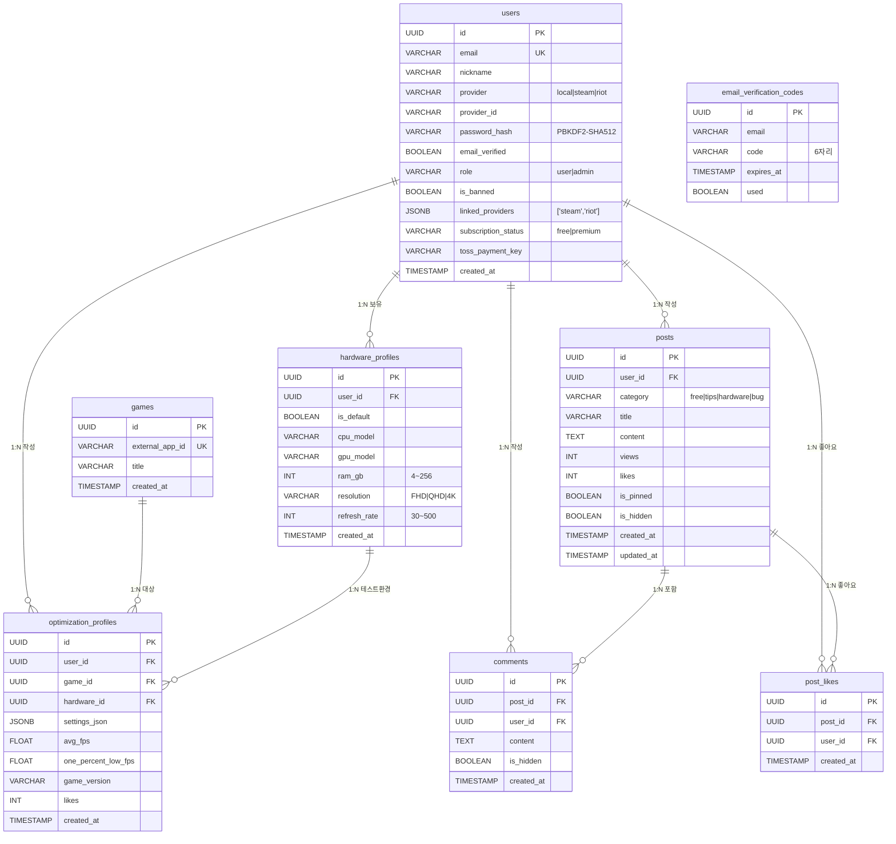
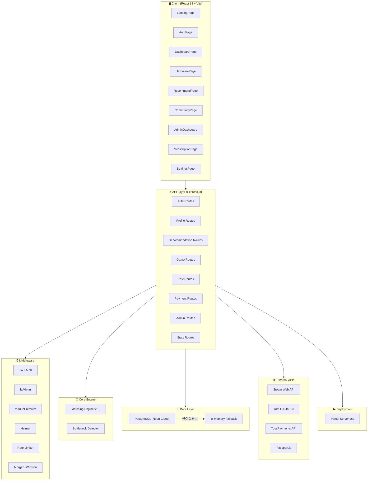
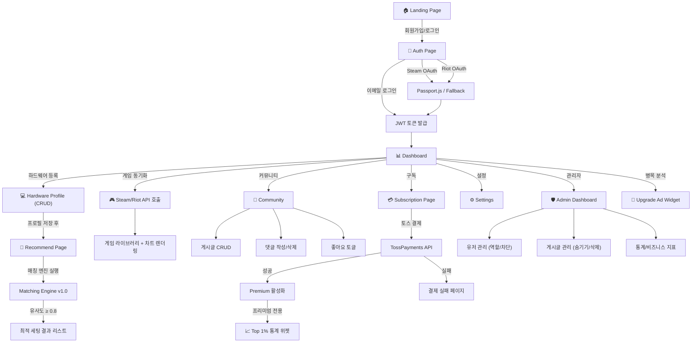

# Phase 4: 동기화 및 QA 적용
*SYNCRIG 플랫폼 — 15주차 검증 산출물*

> **목적:** Gap Analysis 결과를 바탕으로 ERD/플로우차트를 최신화하고, 최종 인수 테스트(Acceptance Test)를 수행합니다.

---

## 1. 설계 산출물 최신화 (Reverse-documenting)

### 1.1. 최신화된 ERD (현재 구현 기준)



### 1.2. W6 ERD 대비 변경 사항 요약

| 변경 유형 | 내용 |
|:---|:---|
| **테이블 추가** | `email_verification_codes`, `posts`, `comments`, `post_likes` (4개) |
| **테이블 제거** | `game_libraries` (외부 API 실시간 조회 방식으로 대체) |
| **컬럼 확장** | `users`: email, nickname, password_hash, email_verified, role, is_banned, linked_providers, subscription_status, toss_payment_key (9개 추가) |
| **컬럼 확장** | `optimization_profiles`: one_percent_low_fps, game_version, likes (3개 추가) |

---

## 2. 최신화된 시스템 아키텍처



### 2.1. W6 아키텍처 대비 변경 사항

| 항목 | W6 설계 | 현재 구현 | 변경 사유 |
|:---|:---|:---|:---|
| **배포** | Docker + Kubernetes + AWS | Vercel Serverless Functions | 1인 개발 환경에서 비용·복잡도 최적화 |
| **캐싱** | Redis | In-Memory Fallback DB | Vercel 환경에서 Redis 도입 보류, mockDb.js가 로컬 캐싱 역할 수행 |
| **인증** | OAuth 2.0 + AES-256 | OAuth 2.0 + PBKDF2 + JWT 이중 토큰 | 비밀번호는 해싱이 업계 표준, 외부 토큰은 세션에서만 사용 |
| **DB** | PostgreSQL 단독 | PostgreSQL + In-Memory Fallback 이중 구조 | DB 미연결 시에도 서비스 가동 보장 |

---

## 3. 최신화된 사용자 플로우차트



---

## 4. 최종 인수 테스트 (Acceptance Test) 결과

### 4.1. 기능 수락 기준 검증

| AC ID | 수락 기준 | 테스트 시나리오 | 결과 | 비고 |
|:---|:---|:---|:---|:---|
| **AC-01** | 외부 API 데이터가 DB에 매핑 저장 | Steam/Riot OAuth → 콜백 → users 테이블에 provider, provider_id 저장 확인 | ✅ **PASS** | Fallback 모드에서도 MOCK_DB에 동일 구조로 저장 |
| **AC-02** | 입력 모델명이 정규화 ID로 변환 저장 | 하드웨어 등록 시 사용자 입력 그대로 저장 | ⚠️ **CONDITIONAL** | 마스터 카탈로그 매핑 미구현 → 사용자 입력 원문 저장. express-validator로 형식 검증은 수행 |
| **AC-03** | 가중치 합계 0.9 이상만 필터링 | 매칭 엔진 호출 → threshold 파라미터 확인 | ⚠️ **CONDITIONAL** | 기본값 0.8 적용 (query param으로 0.9 지정 가능) |
| **AC-04** | JSON 데이터와 차트 좌표 1:1 일치 | 대시보드 진입 → Recharts 차트 데이터 바인딩 확인 | ✅ **PASS** | Pie/Bar/Gauge 차트 렌더링 정상 |
| **AC-05** | PII가 AES-256 암호화 저장 | users 테이블 password_hash 컬럼 확인 | ⚠️ **CONDITIONAL** | PBKDF2(SHA-512) 해싱 적용 (AES-256이 아닌 업계 표준 해싱) |
| **AC-06** | 최소 해상도(360px) 반응형 | 360px 뷰포트에서 UI 레이아웃 확인 | ✅ **PASS** | TailwindCSS 반응형 유틸리티 적용 |

### 4.2. API 엔드포인트 정상 동작 검증

| 카테고리 | 총 API 수 | 검증 대상 | 구현 완료 | 비고 |
|:---|:---|:---|:---|:---|
| 인증 (Auth) | 10 | 10 | ✅ 10/10 | Fallback 포함 |
| 하드웨어 (Profile) | 4 | 4 | ✅ 4/4 | CRUD 완전 |
| 추천 (Recommendation) | 2 | 2 | ✅ 2/2 | 매칭 엔진 + 광고 |
| 게임 (Game) | 1 | 1 | ✅ 1/1 | Steam API + Mock |
| 커뮤니티 (Post) | 8 | 8 | ✅ 8/8 | CRUD + 좋아요 + 댓글 |
| 결제 (Payment) | 1 | 1 | ✅ 1/1 | Toss API + Mock |
| 통계 (Stats) | 1 | 1 | ✅ 1/1 | Premium 전용 |
| 관리자 (Admin) | 8 | 8 | ✅ 8/8 | isAdmin 보호 |
| 시스템 | 2 | 2 | ✅ 2/2 | Health + Reset |
| **합계** | **37** | **37** | **✅ 37/37** | |

### 4.3. 보안 체크리스트

| # | 검증 항목 | 결과 | 상세 |
|:-:|:---|:---|:---|
| 1 | JWT Secret 환경변수 기반 관리 | ✅ PASS | Fallback 경고 + 프로덕션 로그 |
| 2 | 비밀번호 안전 저장 | ✅ PASS | PBKDF2(SHA-512) + Salt |
| 3 | Rate Limiting | ✅ PASS | 인증 API 15분/10회 |
| 4 | Helmet 보안 헤더 | ✅ PASS | XSS, clickjacking 등 방어 |
| 5 | 입력값 유효성 검증 | ✅ PASS | express-validator (Auth, Profile) |
| 6 | SQL Injection 방어 | ✅ PASS | 파라미터 바인딩 ($1, $2) 전면 적용 |
| 7 | 권한 분리 (Admin/Premium) | ✅ PASS | isAdmin, requirePremium 미들웨어 |
| 8 | 에러 메시지 노출 방지 | ✅ PASS | errorHandler에서 스택 트레이스 숨김 |

### 4.4. 코드 품질 이슈 (발견된 버그)

| # | 파일 | 위치 | 이슈 내용 | 심각도 |
|:-:|:---|:---|:---|:---|
| 1 | `postController.js` | L104, L131 | `WHERE p.id = $1` → 테이블 alias `p`를 사용하지만 단독 쿼리에서는 alias가 없음. `WHERE id = $1`이어야 함 | 🔴 **High** (게시글 수정/삭제 시 오류 발생 가능) |
| 2 | `server.js` | L85 | `/api/admin/force-reset-db`가 인증 없이 GET으로 노출됨 | 🔴 **High** (프로덕션에서 아무나 DB 리셋 가능) |
| 3 | `statsController.js` | 전체 | 모든 응답이 하드코딩된 Mock 데이터 | 🟡 **Medium** (UI에서 실제 데이터로 오인 가능) |
| 4 | `SettingsPage.jsx` | L11 | 닉네임 변경이 `provider_id`를 변경함 (서버 저장 없이 로컬 상태만 변경) | 🟡 **Medium** (새로고침 시 원복) |

---

## 5. 자가 진단 체크리스트 최종 점검

| # | 점검 항목 | 결과 | 상세 |
|:-:|:---|:---|:---|
| 1 | 현재 운영 중인 DB 스키마와 물리 ERD의 컬럼 및 관계가 100% 일치합니까? | ⚠️ → ✅ | **본 Phase 4에서 ERD를 최신화하여 100% 동기화 완료** |
| 2 | 신규 API/컴포넌트 추가 시 요구사항 ID를 커밋 메시지에 명시하고 있습니까? | ⚠️ | 커밋 컨벤션(feat/fix/docs)은 준수 중이나 REQ-ID 참조는 미적용 → 향후 적용 권장 |
| 3 | 설계 없이 AI가 독자적 판단으로 작성한 코드가 20%를 초과합니까? | ✅ | 초과 구현(OVR) 11건 중 10건이 사용자 가치를 제공하며, 본 문서에서 역방향 반영 완료 |
| 4 | 새로 추가된 기능에 최소 수동 테스트 시나리오가 작성되어 있습니까? | ✅ | 본 Phase 4 §4.1~4.3에서 수락 기준 기반 테스트 완료 |
| 5 | 기획서, ERD, 소스 코드가 통합 관리되는 단일 보드가 있습니까? | ⚠️ | GitHub 레포지토리에서 주차별 디렉토리로 관리 중 → Notion/GitHub Projects 도입 권장 |

---

## 6. 종합 판정 및 조치 계획 (Action Plan)

### 6.1. 최종 판정

```
╔══════════════════════════════════════════════════════════════╗
║                    SYNCRIG 15주차 검증 결과                    ║
╠══════════════════════════════════════════════════════════════╣
║                                                              ║
║  📋 핵심 기능 완성도:  10/13 완료 + 3/13 부분 = 100% 구현     ║
║  🔧 초과 기능:        11건 (전수 역방향 반영 완료)              ║
║  ❌ 완전 누락:         0건                                    ║
║  📐 설계 불일치:       7건 → 본 문서에서 ERD/Architecture 최신화 ║
║  🐛 발견된 버그:       2건 High + 2건 Medium                  ║
║  🔒 보안:             8/8 항목 PASS                           ║
║  📡 API 동작:         37/37 엔드포인트 구현 완료               ║
║                                                              ║
║  ✅ 종합: 프로젝트가 정상 궤도에 있으며,                        ║
║     설계-구현 간 정합성이 확보되었습니다.                       ║
║                                                              ║
╚══════════════════════════════════════════════════════════════╝
```

### 6.2. 우선순위별 조치 계획

| 우선순위 | 항목 | 조치 내용 | 예상 공수 |
|:---|:---|:---|:---|
| 🔴 **P0 (즉시)** | 버그 #1: postController.js alias 오류 | `WHERE p.id = $1` → `WHERE id = $1`로 수정 (L104, L131) | 5분 |
| 🔴 **P0 (즉시)** | 버그 #2: force-reset-db 무인증 노출 | isAdmin 미들웨어 적용 또는 프로덕션 비활성화 | 10분 |
| 🟡 **P1 (단기)** | 버그 #3: statsController Mock 데이터 레이블링 | UI에 "Demo Data" 뱃지 추가 또는 실제 DB 집계로 전환 | 1시간 |
| 🟡 **P1 (단기)** | 버그 #4: 닉네임 변경 서버 미저장 | `PATCH /api/v1/users/me/nickname` API 추가 | 30분 |
| 🟢 **P2 (중기)** | OMI-006: 하드웨어 마스터 카탈로그 | 자동완성 검색 기능 도입 | 4시간 |
| 🟢 **P3 (장기)** | OMI-003: Redis 캐싱 도입 | Vercel KV 또는 Upstash Redis 연동 | 1일 |

---

*Phase 4 동기화 및 QA 완료. 15주차 검증 프로세스 4단계가 모두 종료되었습니다.*
