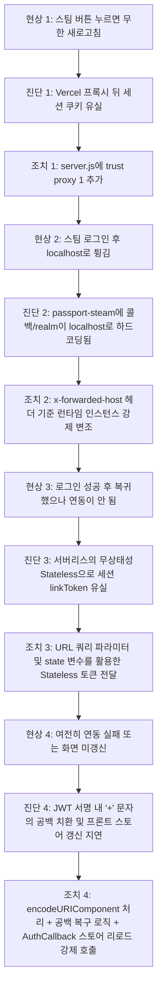

# 📑 Steam & Riot OAuth 연동 트러블슈팅 및 장애 진단 일지
*Vercel 서버리스 배포 환경의 세션 유실 및 OpenID 프로토콜 우회 분석 보고서*

이 문서는 SYNCRIG 플랫폼의 외부 계정(Steam/Riot Games) 연동 기능을 로컬 개발 환경에서 Vercel 클라우드 운영 환경으로 배포하는 과정에서 발생한 일련의 오류 현상, 원인 분석, 그리고 이를 해결하기 위해 취해진 모든 조치 과정을 시간 순서대로 명확히 기록한 진단서입니다.

---

## 📅 트러블슈팅 요약 지도



---

## 1. [1단계] 무한 새로고침 및 쿠키 유실 현상

### 🔴 문제 상황 (Problem)
Vercel에 배포된 운영 서버에서 "Steam 연동 시작하기" 버튼을 클릭하면 스팀 로그인 페이지로 넘어가지 못하고, 대시보드 화면이 깜빡이며 무한 새로고침(또는 연동 실패 리다이렉션)만 반복되는 현상이 발생했습니다.

### 🔍 원인 분석 (Root Cause)
* **프록시 서버와 세션의 불일치**:
  보안 통신을 위해 세션 쿠키 설정에 `cookie.secure = true` 옵션이 적용되어 있었습니다. 그러나 Vercel 호스팅 환경은 사용자의 요청이 리버스 프록시(Reverse Proxy)를 거쳐 백엔드로 전달되는 구조입니다.
  Express 서버는 기본적으로 프록시를 신뢰하지 않기 때문에, 프록시가 중간에서 헤더를 변경하여 전달한 HTTPS 연결을 인지하지 못하고 쿠키를 유실시켰습니다. 이로 인해 스팀 연동에 필요한 기존 세션이 끊어지는 문제가 발생했습니다.

### 💡 해결 방안 (Solution)
* [`server.js`](file:///c:/Users/dlrjs/Desktop/webserviceplatform/webplatform_w10/server/server.js)에 Express 프록시 신뢰 설정을 추가하여 보안 쿠키가 프록시 환경에서도 유실되지 않고 안전하게 유지되도록 조치했습니다.
  ```javascript
  app.set('trust proxy', 1);
  ```

---

## 2. [2단계] 스팀 로그인 후 로컬호스트(localhost) 리다이렉션 현상

### 🔴 문제 상황 (Problem)
무한 새로고침 버그를 해결한 뒤 스팀 로그인 창 진입까지는 성공했으나, 스팀 공식 로그인 사이트 상단에 **"Steam 계정을 사용해 localhost에 로그인"** 이라는 비정상적인 경고가 표시되었습니다.
이후 실제 로그인을 누르면 배포 서버 도메인이 아닌 `http://localhost:5000/api/v1/auth/steam/callback`으로 리다이렉션되어 **`ERR_CONNECTION_REFUSED` (사이트에 연결할 수 없음)** 에러 화면이 나타났습니다.

### 🔍 원인 분석 (Root Cause)
* **OpenID 2.0 규격과 `passport-openid` 라이브러리의 설계 한계**:
  * 스팀 OpenID 인증 프로토콜은 되돌아갈 경로인 `return_to`(`returnURL`) 주소와 인증을 요청한 도메인 영역인 `realm` 정보의 일치 여부를 엄격히 확인합니다.
  * 기존 백엔드에서는 Vercel 배포 도메인을 인식하기 위해 `passport.authenticate('steam', { returnURL: dynamicURL })` 형식으로 동적 콜백 지정을 수행했습니다.
  * 그러나 `passport-steam` 및 그 기반인 `passport-openid` 라이브러리는 **`passport.authenticate()`의 두 번째 인자(옵션)를 런타임에 완전히 무시**하고, 오직 최초 서버 구동(생성자 시점) 시 등록된 `SERVER_URL` (기본값: `localhost:5000`) 정보만 강제로 가져다 쓰는 심각한 라이브러리 설계적 결함이 있었습니다.
  * 이로 인해 운영 서버 도메인에서 요청을 보냈음에도 스팀 측은 항상 요청 서버를 `localhost`로 인지했고, 로그인 완료 시 브라우저를 로컬호스트로 튕겨버렸습니다.

### 💡 해결 방안 (Solution)
* **런타임 인스턴스 동적 변조(Runtime Mutation)**:
  옵션을 통한 동적 전달이 불가능하므로, 요청이 들어온 라우터 미들웨어 진입 직전에 **Passport 전역 싱글톤에 등록되어 있는 스팀 전략 인스턴스의 프로퍼티 값을 수동으로 직접 변경**하는 패치를 적용했습니다.
  ```javascript
  const steamStrategy = passport._strategies && passport._strategies.steam;
  if (steamStrategy && steamStrategy._relyingParty) {
    steamStrategy._relyingParty.returnUrl = dynamicReturnURL; // 동적 콜백 주입
    steamStrategy._relyingParty.realm = dynamicRealm;         // 동적 Realm 주입
  }
  ```
  이 조치로 인해 스팀 인증 서버가 실제 운영 서버 도메인을 정상적으로 인식하고 콜백 주소도 알맞게 반환하게 되었습니다.

---

## 3. [3단계] 대시보드 복귀 후 연동 정보 유실 현상

### 🔴 문제 상황 (Problem)
도메인이 정상 동작하여 스팀 로그인 완료 후 플랫폼 대시보드로 자연스럽게 돌아왔음에도 불구하고, 화면상의 스팀 연동 정보가 "미연동"으로 계속 남아있으며 실제 계정 연동(Link)이 진행되지 않는 상태가 지속되었습니다.

### 🔍 원인 분석 (Root Cause)
* **서버리스(Serverless)의 무상태성(Stateless)과 세션 증발**:
  * 스팀으로 떠나기 전 백엔드는 현재 로그인된 사용자를 기억하기 위해 `req.session.linkToken = JWT_TOKEN` 형태로 인메모리 세션에 토큰을 저장했습니다.
  * 그러나 Vercel 서버리스 환경은 물리적인 세션 서버(Redis 등)가 없으면 **매 요청마다 다른 컨테이너가 가동되는 무상태성 구조**입니다.
  * 사용자가 스팀 페이지를 다녀오는 사이, 기존에 세션 토큰을 기억하고 있던 컨테이너 프로세스가 종료되었거나 아예 다른 인스턴스가 요청을 받으면서 **`linkToken` 세션 데이터가 100% 증발**하였습니다.
  * 이로 인해 백엔드 콜백 시 연동 모드임을 파악하지 못해 계정 병합을 누락하고 일반 신규 회원가입으로만 흐름을 우회 처리하여 연동이 적용되지 않았습니다.

### 💡 해결 방안 (Solution)
* **무상태(Stateless) URL 파라미터 및 OAuth state 파라미터 우회**:
  서버 세션 메모리에 아예 의존하지 않도록 계정 인증 토큰을 외부 인증 주소의 파라미터에 실어 함께 보냈다가 다시 그대로 받아오는 방식으로 구조를 전면 전환했습니다.
  * **Steam (OpenID)**: 콜백 주소 뒤에 쿼리 스트링(`?linkToken=JWT_TOKEN`)을 이어 붙여 스팀이 인증 완료 시 이 토큰을 포함한 URL로 복귀하도록 설계했습니다.
  * **Riot (OAuth 2.0)**: OAuth 2.0 표준 규격의 `state` 파라미터에 JWT 토큰을 실어 보내 인증 성공 시 그대로 응답받도록 조치했습니다.
  * **백엔드**: `oauthCallback` 도달 시 세션 대신 `req.query.linkToken` 또는 `req.query.state`를 먼저 스캔하여 유저 정보를 안전하게 복원하도록 수정했습니다.

---

## 4. [4단계] URL 파라미터 특수문자 깨짐 및 상태 갱신 지연

### 🔴 문제 상황 (Problem)
Stateless 전송 방식을 도입했음에도 여전히 실서버에서 연동 처리가 완료되지 않고 대시보드가 "미연동" 상태로 유지되는 현상이 계속되었습니다.

### 🔍 원인 분석 (Root Cause)
두 가지 미세한 걸림돌이 동시에 복합적으로 작용하여 연동 성공을 가로막았습니다.
1. **Base64 서명 속 플러스(`+`) 문자의 공백 치환 현상 (백엔드 이슈)**:
   * JWT 토큰을 쿼리 스트링으로 보내는 과정에서, Base64로 인코딩된 토큰 내용 중 플러스(`+`) 기호가 웹 서버(Express) 쿼리 파서에 의해 **공백(Space, ` `)으로 자동 디코딩**되어 유입되었습니다.
   * 서명에 공백이 섞인 토큰은 유효하지 않은 서명으로 판정되어 백엔드에서 인증에 실패하고 일반 로그인 흐름으로 강제 우회되었습니다.
2. **리액트 렌더링 상태의 미갱신 (프론트엔드 이슈)**:
   * 스팀에서 콜백 페이지([`AuthCallback.jsx`](file:///c:/Users/dlrjs/Desktop/webserviceplatform/webplatform_w10/client/src/pages/AuthCallback.jsx))로 돌아왔을 때 스토리지에 새 토큰만 교체해두고 **Zustand 전역 상태 스토어의 데이터 갱신(initialize)** 없이 즉시 홈(`/`)으로 리다이렉션시켰습니다.
   * 이로 인해 브라우저 새로고침(F5)을 수동으로 해주기 전까지는 React 메모리 상의 이전 유저 세션 정보(연동 없음)가 그대로 렌더링되는 시각적 상태 지연이 발생했습니다.

### 💡 해결 방안 (Solution)
* **인코딩 안전 조치 및 공백 치환 전처리 적용**:
  * 스팀 `returnURL` 주입 시 토큰을 `encodeURIComponent(linkToken)`으로 철저하게 감싸 특수문자가 훼손되는 현상을 방지했습니다.
  * 백엔드 컨트롤러와 라우터가 토큰을 넘겨받아 복호화하기 직전, 혹시 모를 브라우저 디코딩 오작동에 대비해 모든 공백(` `)을 다시 원래의 `+` 기호로 치환하는 안정화 코드(`linkToken.replace(/ /g, '+')`)를 도입했습니다.
* **콜백 렌더링 시점의 스토어 초기화 강제화**:
  * 프론트엔드 콜백 컴포넌트(`AuthCallback.jsx`)가 새 토큰을 스토리지에 올린 직후 `await useAuthStore.getState().initialize()`를 호출하여 Zustand 전역 변수(유저 스펙 및 연동 정보)가 완전히 업데이트된 상태를 보장받고 대시보드 화면을 그리도록 변경했습니다.

---

## 5. 다른 대안 분석 및 향후 설계 가이드 (Alternative & Guide)

프로젝트 규모가 확장되거나 보다 높은 수준의 인프라 보안 및 무결성이 필요할 경우, 본 트러블슈팅의 런타임 변조 및 임시 우회 대신 다음 아키텍처 도입을 권장합니다.

| 분류 | 현재 해결책 | 향후 권장 대안 (Alternative) | 대안 도입 시 장점 |
|:---|:---|:---|:---|
| **세션 데이터 관리** | URL Query String / OAuth `state` 우회 | **Redis/Vercel KV 기반 외부 세션 스토어** | 브라우저 주소창에 JWT 토큰을 노출하지 않아도 되므로 보안 유출 리스크 최소화 |
| **스팀 OpenID 제어** | Passport 전역 전략 인스턴스 런타임 값 패치 | **자체 스팀 OpenID 핸들러 작성** (Passport 전격 탈피) | 라이더 결함이 있는 레거시 라이브러리를 사용하지 않고 완벽하게 동적 처리가 가능한 클린 코드 구축 가능 |
| **API 통신 구조** | `/api/v1/auth/steam` 단순 리다이렉트 | **One-time 임시 연동 티켓 구조** | 연동 요청 시 일회성 티켓 번호를 DB/메모리에 생성하고 스팀 복귀 시 대조함으로써 CSRF 및 위조 차단 |
